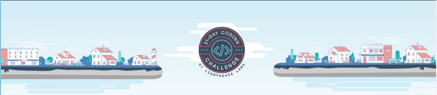

# 21 Days Coding Challenge
by Lighthouse Labs

This is just my solutions that were accepted by them, so keep in mind the following:
1. They are not necessarily the **best** solution, but only the solutions I was able to come up in timely manner
1. The descriptions for each challenge belongs to Lighthouse Labs and all rights are reserved to them.(meaning any complaint about the questions, got after them).
1. Created this file just to have recorded a memory of these fun challenges. I'm not promoting them or work for them (but if they want to hire me, I wouldn't mind).
1. If know a better answer for a given challenge, you can either post it on another branch or shut up about it.

All the folders have the file **description.md** that contains the challenge description and expected Inputs and Outputs.
Also my answer for the challenge is on the **.js** file on the same folder

I hope you can enjoy and have fun!!
